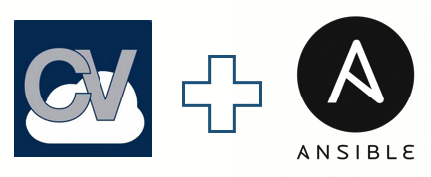

 

# Ansible AVD & CVP TOI Labs

## About

This repository is part of [`arista.cvp`](https://github.com/aristanetworks/ansible-cvp) & [`arista.avd`](https://github.com/aristanetworks/ansible-avd) ansible collections and provides lab materials. It contains lab playbooks.

<p align="center">
  
</p>

## List of available labs

- Ansible Basics:
  - [_Basics and template management_](ansible-basics/)

- Arista Validated Design:
  - _AVD Lab_: [Use Ansible as configuration builder](avd)

- Ansible & CloudVision:
  - _Lab 01_: [Ansible Basics](labs/lab01-ansible-basics)
  - _Lab 02_: [CloudVision Collection overview](labs/lab02-arista.cvp-overview)
  - _Lab 03_: [Configlets](labs/lab03-cv-configlets)
  - _Lab 04_: [Containers](labs/lab04-cv-containers)
  - _Lab 05_: [Devices](labs/lab05-cv-device)
  - _Lab 06_: [Tasks](labs/lab05-cv-tasks)

## Getting Started

```shell
# Clone repository
git clone https://github.com/arista-netdevops-community/ansible-cvp-toi.git

# Move to directory
cd ansible-cvp-toi

# Start docker container
$ docker run -it --rm -v $(PWD):/projects avdteam/base:3.6

# Move to lab folder
$ cd labs

# Edit inventory file
$ vim inventory.yml
```

## Configure Lab Environment

- [Arista Test Drive (ATD)](docs/atd-setup.md) for lab environment
- [Docker Environment](docs/docker-setup.md) (preferred method)
- [Virtual Environment](docs/venv-setup.md)

## Resources

- [Arista Ansible AVD Collection](https://github.com/aristanetworks/ansible-avd)
- [Arista Cloudvision Collection](https://github.com/aristanetworks/ansible-cvp)
- [AVD & CVP Collections demo](https://github.com/arista-netdevops-community/ansible-avd-cloudvision-demo)

## License

Project is published under [Apache License]().
