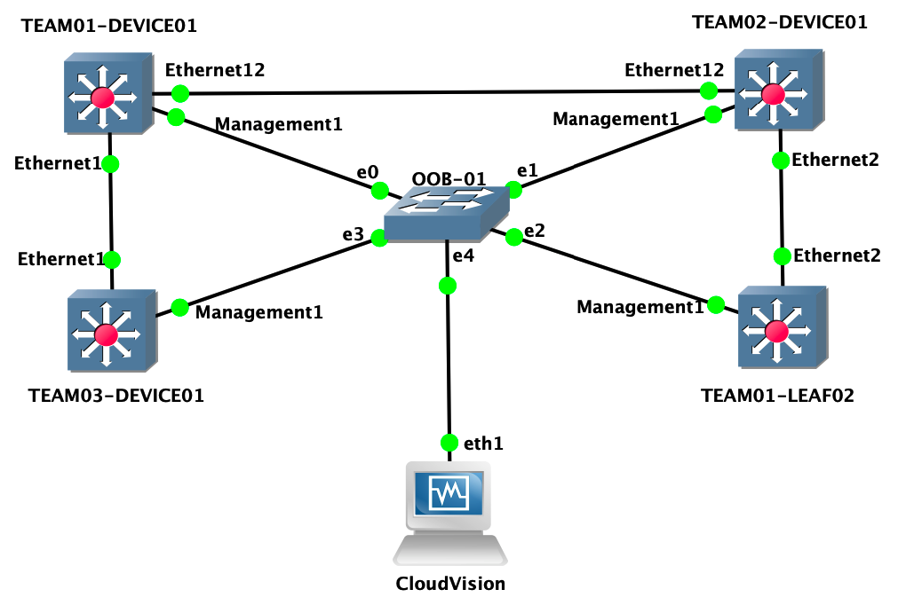

# Lab Management



## Provision lab for TOI

__Edit [`group_vars/ZTP/ztp_config.yml`](group_vars/ZTP/ztp_config.yml)__

In this file, you can define 

- List of student group name
- Device Hostname
- Group membership of every device
- Device mac-address

```yaml
---
[...]
  # Name of lab group
  groupAttendees:
    - TEAM01
    - TEAM02
    - TEAM03
    - TEAM04

  # Name of vEOS devices loaded to support TOI
  clients:
      # Device name. device hostname will be {{group}}-{{name}}
    - name: DEVICE01
      # Group where device is binded
      group: TEAM01
      # Mac address for ZTP process
      mac: 0c:1a:c1:00:00:01
      # OOB Address configured for ZTP
      ip4: 10.255.0.111

```

You can also configure CloudVision IP address used to support ZTP and device connectivity.

```yaml
ztp:
  general:
    network: 10.255.0.0
    netmask: 255.255.255.0
    gateway: 10.255.0.1
    nameserver: '1.1.1.1, 8.8.8.8'
    start: 10.255.0.200
    end: 10.255.0.250
    cvp: 10.255.0.1
    registration: 'http://10.255.0.1/ztp/bootstrap'
```

__Update Inventory__

```ini
$ cat inventory.ini

[CloudVision:vars]
ansible_httpapi_host= 10.83.28.164
ansible_host= 10.83.28.164
ansible_user= ansible
ansible_password= ansible
# Configuration to get Virtual Env information
ansible_python_interpreter= $(which python)

[ZTP:vars]
ansible_host= 10.83.28.164
ansible_user= root
ansible_password= ansible
```

__Run playbook__

```shell
# Move to provisioning folder
$ cd lab-provisionning

# Run playbook
$ ansible-playbook lab-content-provisionning.yml
```
This playbook configures:
- Zero Touch Provisioning on CV server
- Base Config for EOS devices
- Lab definition to build/reset labs

## Lab Management

Every lab has its own provisionning playbook to configure lab environment:

- Lab 02 : `lab02-setup.yml`
- Lab 03 : `lab03-setup.yml`
- Lab 04 : `lab04-setup.yml`
- Lab 05 : `lab05-setup.yml`
- Lab 06 : `lab06-setup.yml`

All labs topology are generated using template saved under [templates](templates) folder.

To completely reset lab, following playbook can be used:

```shell
$ ansible-playbook lab-reset.yml
```